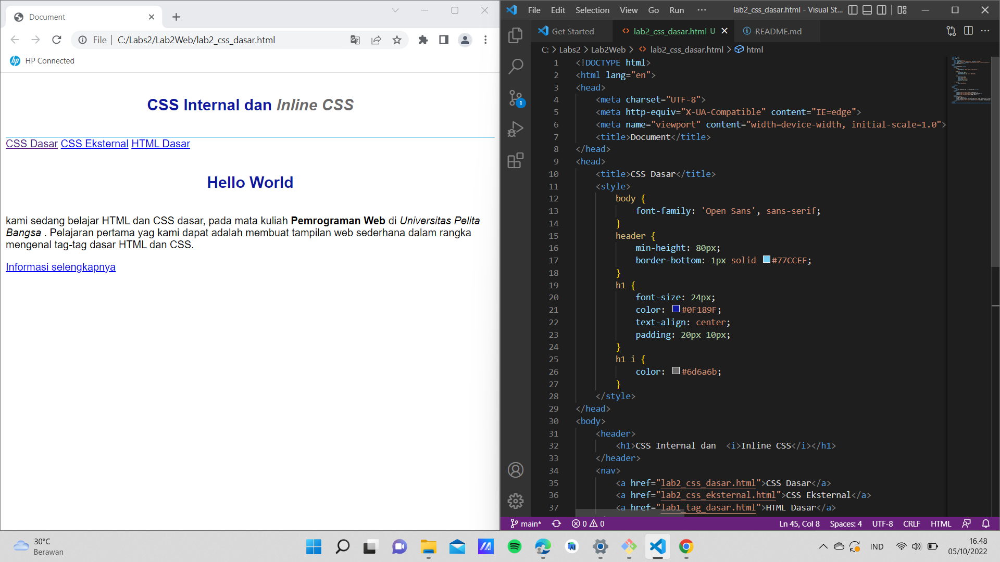

# Lab2Web
# Membuat dokumen HTML
ini adalah tampilannya 

# Mendeklarasikan CSS Internal 
ini adalah tampilannya

# Menambahkan Inline CSS
ini adalah tampilannya 

# Membuat CSS Eksternal
ini adalah tampilannya

# Menambahkan CSS Selector
ini adalah tampilannya

